# Azure Secure Infrastructure Project

## Overview
This project demonstrates the implementation of a secure Azure infrastructure environment focused on private connectivity, identity-based access, and secure administrative access.

The environment was built as part of my Azure Administrator (AZ-104) learning path and includes networking, security, storage, identity, and private endpoint integration.

---

## Architecture
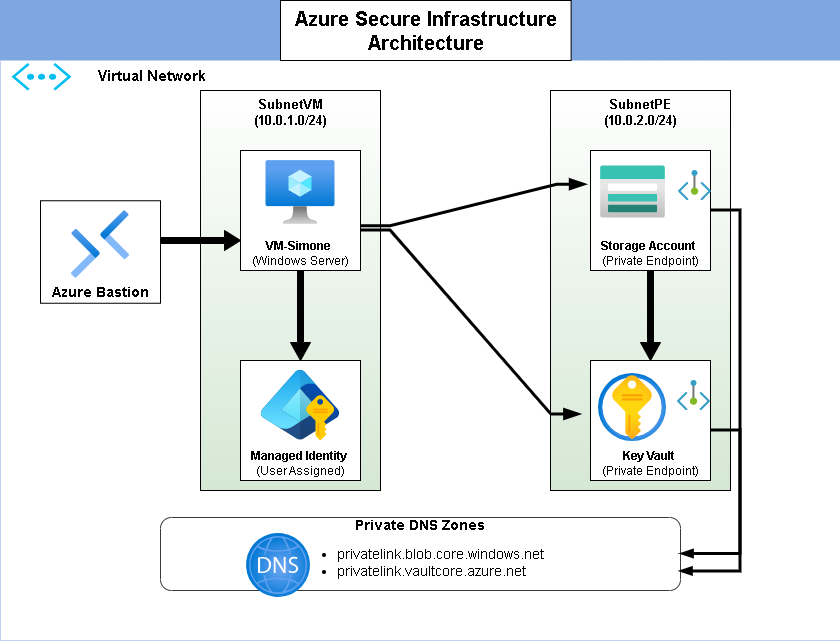

---

# Project Goals

- Deploy a secure Azure Virtual Machine environment
- Implement private access to Azure services
- Avoid public exposure of sensitive resources
- Use identity-based authentication instead of embedded credentials
- Demonstrate Azure networking and security best practices

---

# Azure Services Used

## Compute
- Azure Virtual Machine

## Networking
- Virtual Network (VNet)
- Subnets
- Network Security Group (NSG)
- Azure Bastion
- Private Endpoints
- Private DNS Zones

## Security
- Azure Key Vault
- Managed Identity
- IAM (RBAC)

## Storage
- Azure Storage Account

---

# Security Design

## Secure Administrative Access
The Virtual Machine is accessed through Azure Bastion, avoiding direct public RDP exposure.

## Private Connectivity
Storage Account and Key Vault are integrated using Private Endpoints and Private DNS Zones to ensure private communication inside the Virtual Network.

## Identity-Based Access
Managed Identity is used to securely authenticate Azure resources without storing credentials inside the VM.

---

# Networking Design

The infrastructure is divided into separate subnets:

- Compute Subnet
- Private Endpoint Subnet

Private DNS Zones are configured for:
- privatelink.blob.core.windows.net
- privatelink.vaultcore.azure.net

---

# Skills Demonstrated

- Azure Infrastructure Administration
- Azure Networking
- Private Link / Private Endpoints
- Identity and Access Management (IAM)
- Azure Security Best Practices
- Secure Remote Administration
- Azure Resource Organization

---

# Screenshots

## Resource Group
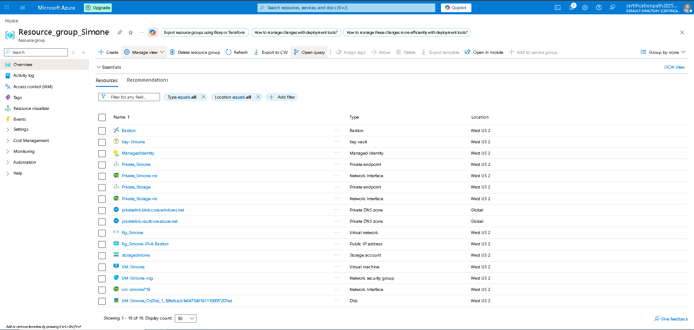

---

## Virtual Network
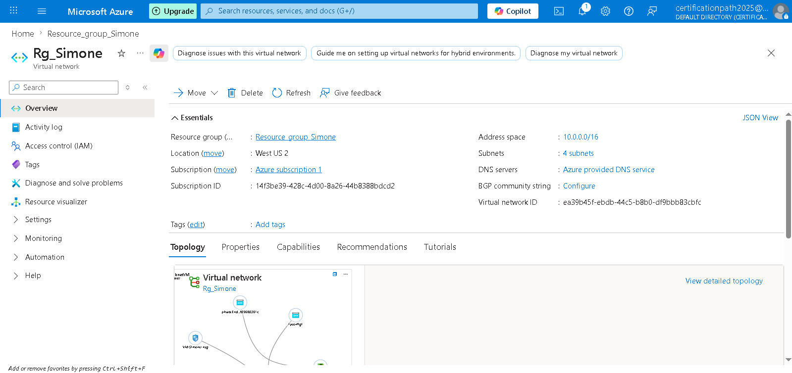

## Subnets
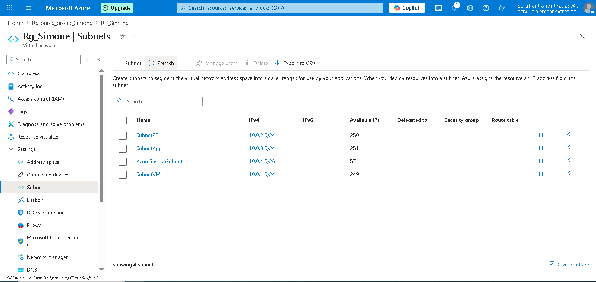

---

## Virtual Machine
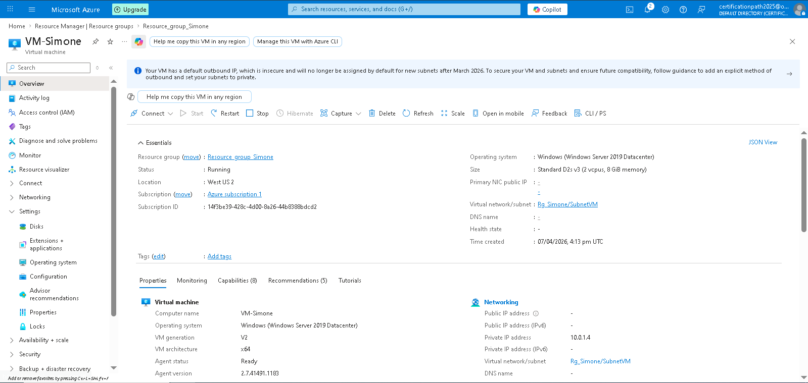

## VM Networking
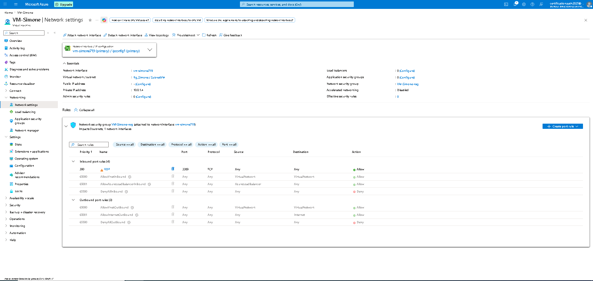

## NIC Overview
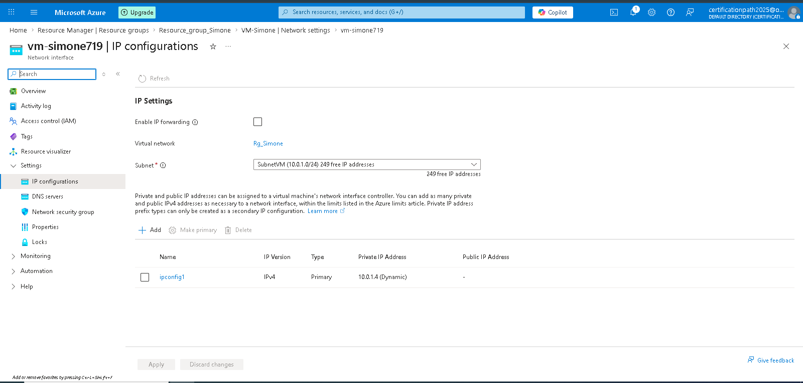

---

## Network Security Group
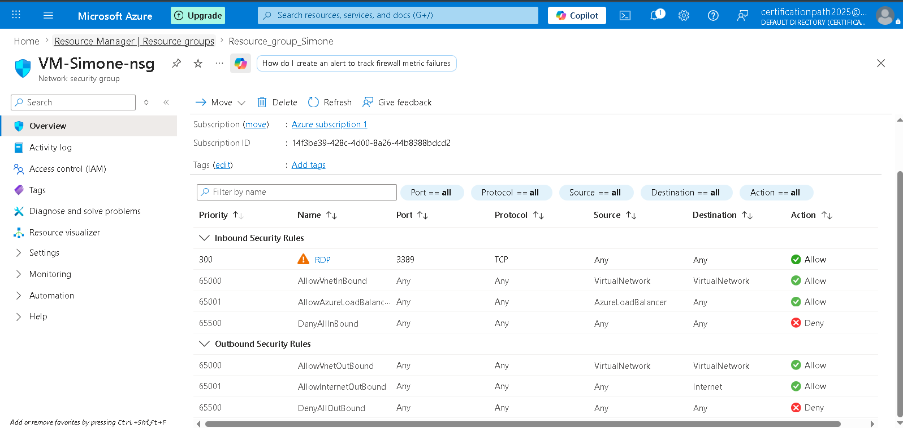

---

## Azure Bastion
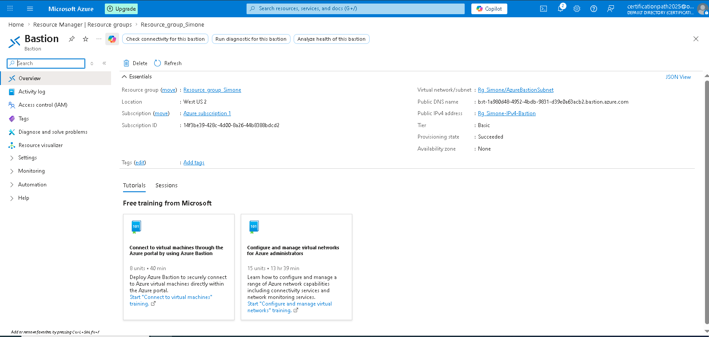

---

## Storage Account
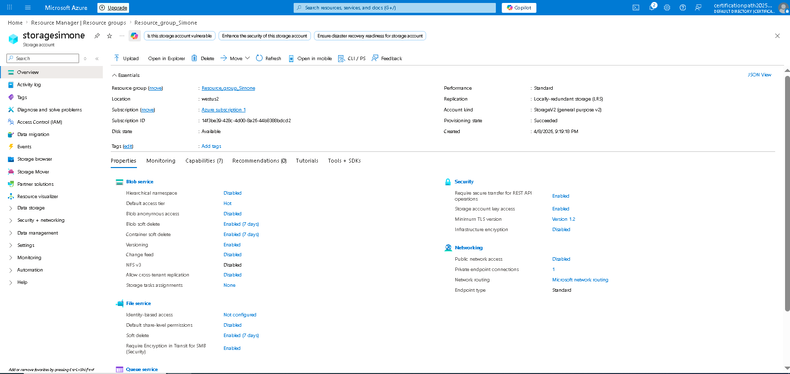

## Storage Private Endpoint
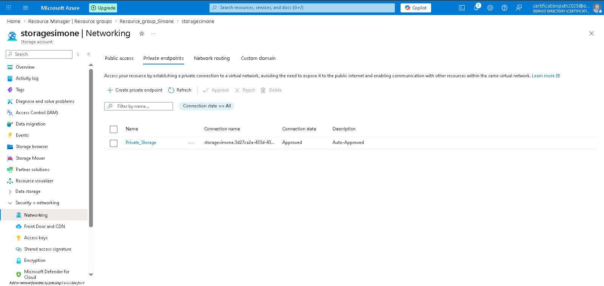

## Storage IAM
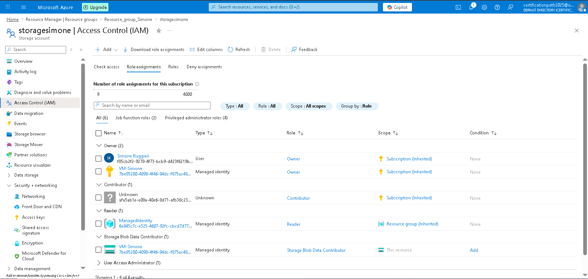

---

## Key Vault
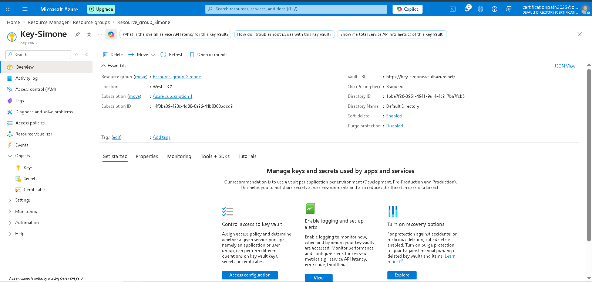

## Key Vault Networking

## Key Vault IAM
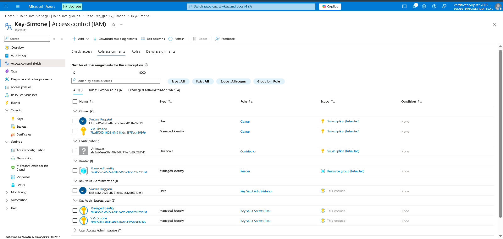

---

## Private DNS
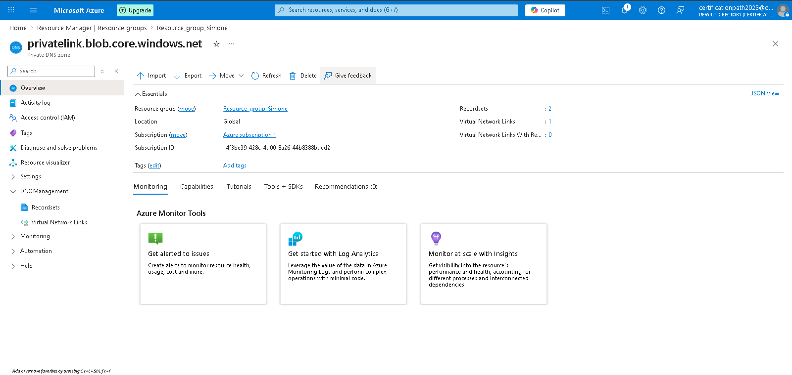

## Private Endpoint
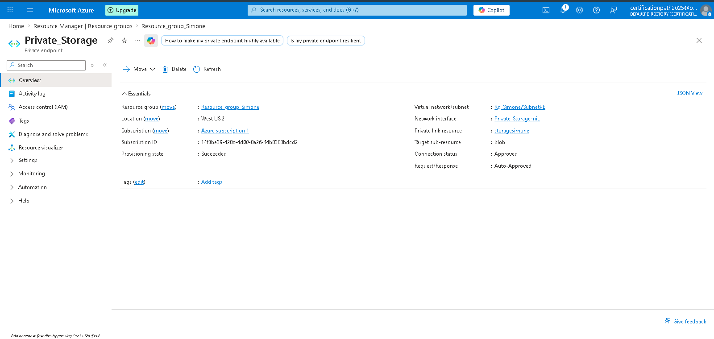

## Private Endpoint DNS
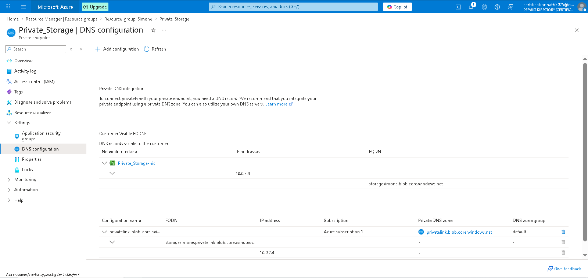

---

## Managed Identity
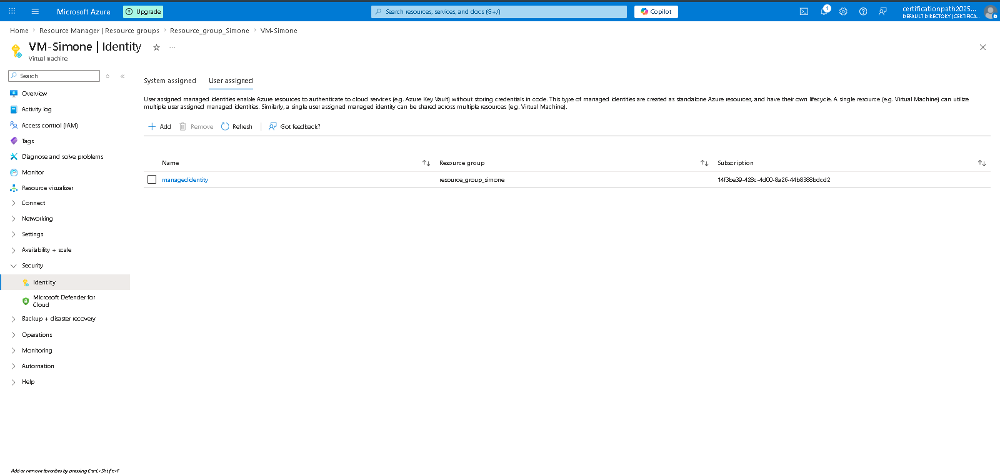

---

# Notes

This project was created for learning and portfolio purposes as part of my transition into Cloud Administration and Azure infrastructure management.
